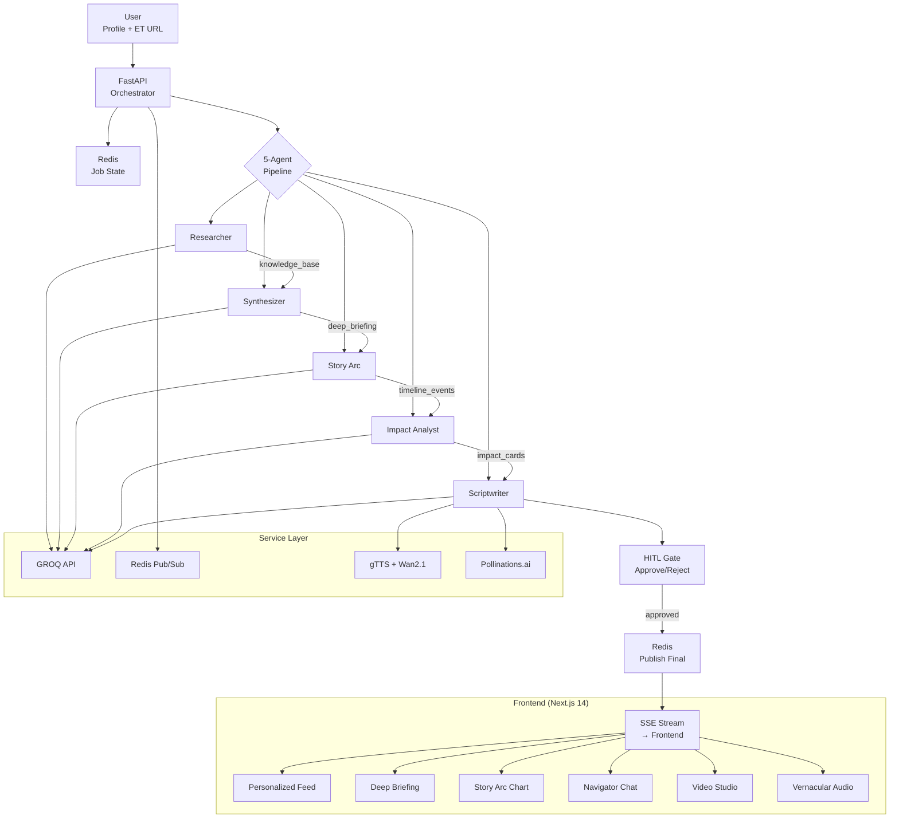
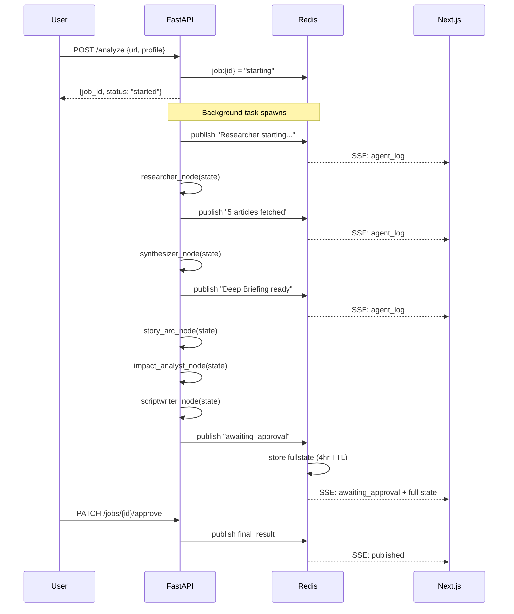
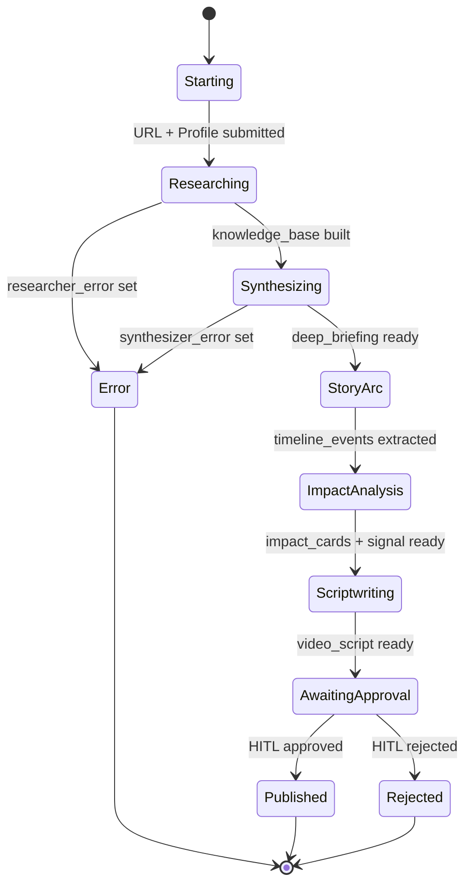
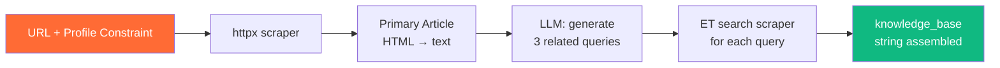
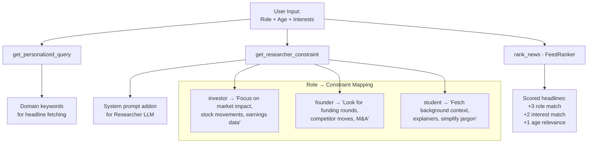
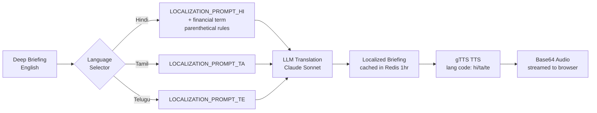
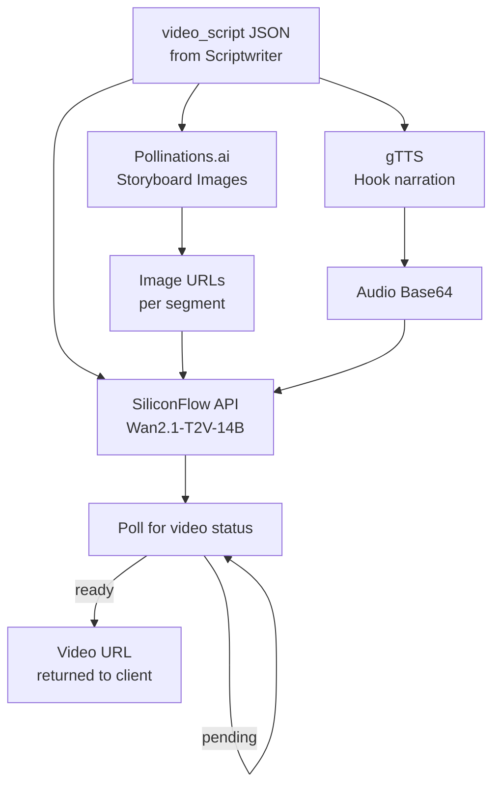

# ET NewsFlow — AI-Powered News Intelligence Platform

> **"News that knows you."** — Transforming Economic Times from a publisher into a personalized intelligence engine.

---


## Problem Statement

Business news in 2026 is still delivered like it's 2005, static text articles, one-size-fits-all homepage, same format for everyone. ET NewsFlow fixes this across 5 intelligent dimensions:

| # | Feature | The Old Way | The ET NewsFlow Way |
|---|---------|-------------|---------------------|
| 1 | **My ET** | Same homepage for all | Role-aware personalized feed |
| 2 | **News Navigator** | 8 separate articles | 1 interactive synthesized briefing |
| 3 | **Video Studio** | Text only | Article → 60s broadcast video |
| 4 | **Story Arc** | Disconnected stories | Interactive narrative timeline |
| 5 | **Vernacular Engine** | English only | Hindi/Tamil/Telugu with financial context |

---

## System Architecture

### High-Level Overview



### Agent Communication Protocol



### State Machine (LangGraph)



---

## Agent Deep Dive

### Agent 1: Researcher
**File:** `backend/agents/researcher.py`

**Intuition:** The LLM needs raw material before it can synthesize. The Researcher fetches the primary article and scrapes ET for context. Crucially, it applies a profile constraint to its system prompt so the same article gets researched differently depending on whether the reader is an investor or a student.



**Key Design:** Profile constraint is injected into the researcher's system prompt, not the user message. This means the LLM's entire reasoning frame changes — an investor's Researcher focuses on market impact, a student's Researcher surfaces explainers.

---

### Agent 2: Synthesizer
**File:** `backend/agents/synthesizer.py`

**Intuition:** The Synthesizer is an analyst it reads everything the Researcher found and writes a structured briefing with exactly 5 sections. The rigid structure (enforced via prompt) ensures the frontend always knows what to render.

```
## Key Development      ← What happened
## Why It Matters Now   ← Urgency + stakes  
## The Bigger Trend     ← Macro context
## Contrarian View      ← Intellectual honesty
## Data Points          ← Verifiable numbers
THEMES_JSON: [...]      ← Parsed separately for tag cloud
```


---

### Agent 3: Story Arc Detective
**File:** `backend/agents/story_arc.py`

**Intuition:** Every news story is an episode in a longer narrative. Story Arc connects the dots, it extracts 6–8 dated events, assigns sentiment scores from -1.0 to +1.0, and maps key entities. The frontend renders these as an interactive timeline with a sentiment curve.

```mermaid
flowchart TD
    A[knowledge_base] --> B[LLM: extract\n6-8 events as JSON]
    B --> C{Valid JSON?}
    C -->|Yes| D[Sort by date]
    C -->|No| E[Regex fallback\n+ story_arc_error]
    D --> F[timeline_events[]\nwith sentiment_score]
    F --> G[Interactive Timeline\non Frontend]
```

---

### Agent 4: Impact Analyst
**File:** `backend/agents/impact_analyst.py`

**Intuition:** News has different implications for different stakeholders. Rather than one generic takeaway, Impact Analyst generates 3 persona-specific impact cards (Retail Investor, Corporate Exec, Student) plus a portfolio signal (BUY/WATCH/SELL) for the user's held stocks.

```mermaid
flowchart LR
    A[knowledge_base +\nuser_portfolio[]] --> B[LLM: 3-persona\nJSON impact cards]
    B --> C[impact_cards[]\nper persona]
    A --> D[LLM: portfolio scan\nfor each held stock]
    D --> E[portfolio_signal\nBUY/WATCH/SELL]
    C & E --> F[Impact Cards UI\n+ Signal Banner]
```


---

### Agent 5: Scriptwriter
**File:** `backend/agents/scriptwriter.py`

**Intuition:** The deepest form of content repurposing — turn text into broadcast. The Scriptwriter outputs a structured video script with a 5-second hook, 6 timed segments, and visual cue descriptions. This directly feeds the Video Studio's generation pipeline.

```json
{
  "hook": "India's biggest bank just did something that could affect every savings account...",
  "segments": ["Segment 1 (0:05-0:15): context setup", "..."],
  "visual_cues": [
    {"timestamp": "0:00", "description": "Dramatic zoom on stock ticker"},
    {"timestamp": "0:35", "description": "Animated bar chart appearing"}
  ],
  "call_to_action": "Read the full story on Economic Times"
}
```

---

## Personalization Engine



---

## Vernacular Engine



---

## Video Studio Pipeline



---

## Feature Coverage Matrix

| Feature | My ET | Navigator | Video Studio | Story Arc | Vernacular |
|---------|-------|-----------|--------------|-----------|------------|
| Personalization | ✅ Full | ✅ Profile-aware | ✅ Script tone | ✅ Entity focus | ✅ Role adapts |
| LLM Agent | FeedRanker + Researcher | Synthesizer + Navigator | Scriptwriter | Story Arc | Localization |
| Real-time SSE | ✅ | ✅ | ✅ Poll | ✅ | ✅ |
| Caching | Redis 4hr | Redis 4hr | Redis 1hr | Redis 4hr | Redis 1hr |
| Offline fallback | ✅ Rule-based ranker | ❌ | ❌ | ✅ Empty timeline | ❌ |
| Languages | EN | EN | EN | EN | HI/TA/TE/BN |

---

## Project Structure

```
et-newsflow/
├── backend/
│   ├── main.py                    # FastAPI app, all routes, pipeline runner
│   ├── agents/
│   │   ├── researcher.py          # Agent 1: Article scraping + profile constraint
│   │   ├── synthesizer.py         # Agent 2: Deep Briefing generation
│   │   ├── story_arc.py           # Agent 3: Timeline + sentiment extraction
│   │   ├── impact_analyst.py      # Agent 4: Portfolio signals + persona cards
│   │   ├── scriptwriter.py        # Agent 5: Broadcast video script
│   │   ├── navigator.py           # Chat Q&A from article knowledge base
│   │   ├── navigator_search.py    # Multi-article synthesis for search
│   │   ├── news_fetcher.py        # Profile-aware ET headline scraper
│   │   ├── personalization.py     # Role → query/constraint mapping
│   │   ├── localization.py        # Vernacular translation engine
│   │   ├── audio_agent.py         # Multilingual TTS (gTTS)
│   │   ├── feed_ranker.py         # Headline scoring by profile
│   │   ├── video_studio.py        # Wan2.1 + Pollinations video pipeline
│   │   └── search_agent.py        # Free-form financial search Q&A
│   ├── services/
│   │   ├── llm.py                 # GROQ api call for LLM
│   │   ├── cache.py               # Redis client, pub/sub, job state helpers
│   │   └── scraper.py             # httpx-based HTML scraper
│   └── workflow/
│       ├── graph.py               # LangGraph state machine definition
│       └── state.py               # Typed state schema
└── frontend/
    └── app/
        ├── page.tsx               # Landing: profile onboarding + trending feed
        └── dashboard/[jobId]/
            └── page.tsx           # Full dashboard: briefing + all features

```


## Setup & Running

### Quick Start

1. Open a terminal and follow the commands.

```bash 
git clone <repo>
cd et-newsflow
redis-server
```

2. Starting backend in second terminal 

```bash 
cd backend
pip install -r requirements.txt 
uvicorn main:app --reload --port 8000
```

3. Starting frontend in third terminal

```bash 
cd frontend 
npm install 
npm run dev 
```

---


